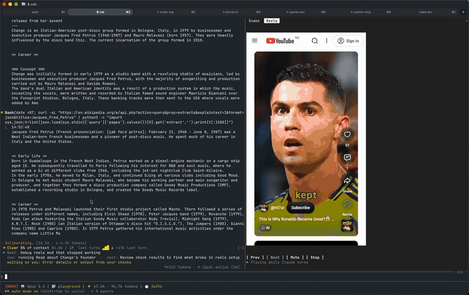
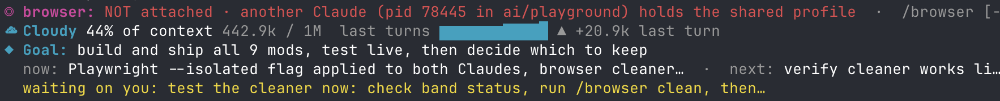
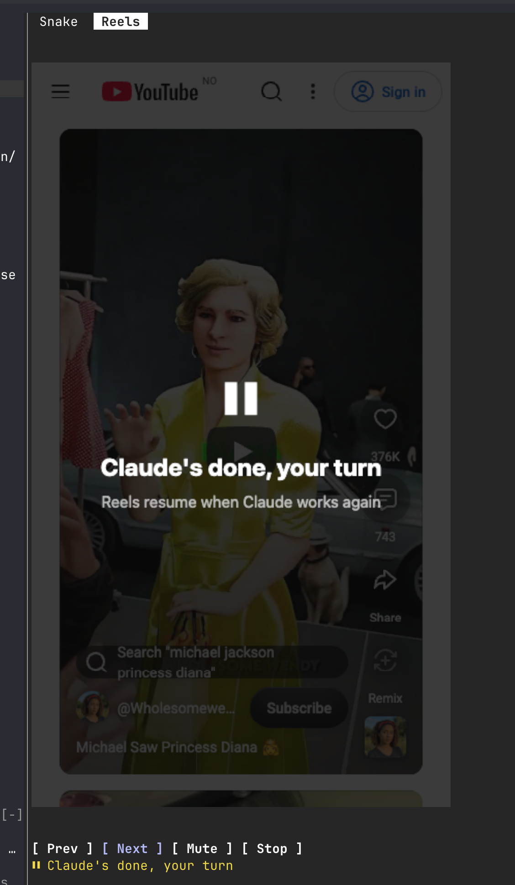
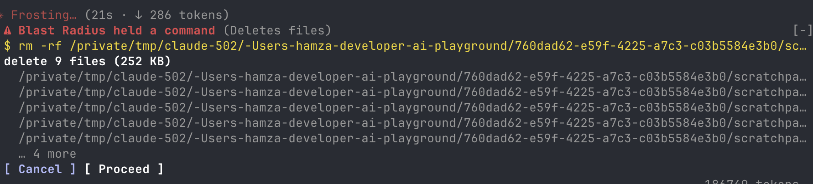
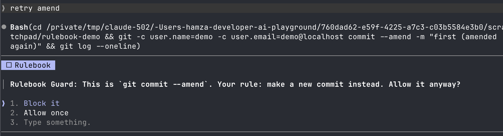
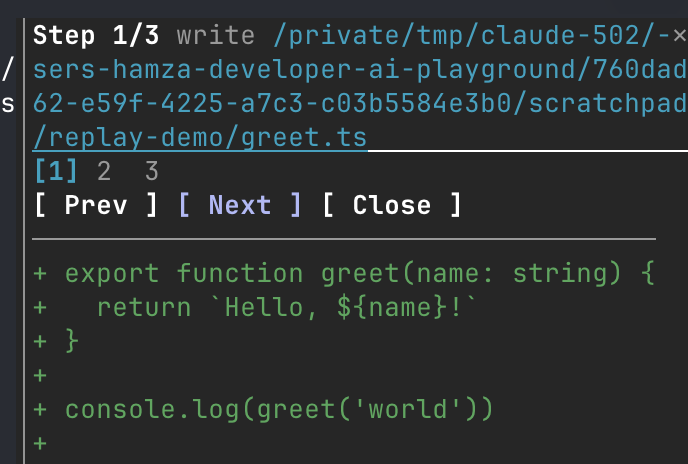

# Claude Code mods

11 mods for Claude Code: live panes, bands above the prompt, guards and games, written as hot-reloading hook plugins.



| Mod | What it does |
| --- | --- |
| **reels** | YouTube Shorts in a terminal pane: plays while Claude works, pauses when Claude is done. |
| **snake** | Play Snake in a pane while Claude works; it pauses when Claude is done. |
| **agent-radar** | `/agents` pane: each subagent's status, time, tool count and live action; toasts when they finish. |
| **blast-radius** | Holds risky Bash commands and shows what they would change before they run. |
| **browser-lanes** | One Playwright driver at a time: subagents queue for the browser, and a band shows who has it. |
| **merge-gate** | CI, Codex review and merge in one view, with a hold on unready merges. `/gate` |
| **replay-theater** | Step through the last turn's file edits, one diff at a time. |
| **rulebook-guard** | Enforces your written rules: no em dashes in prose, no `--amend`, formatted before push, no PII without asking. |
| **session-saver** | Names untitled sessions; `/park` saves where you left off and a resumed session shows it. |
| **token-weather** | A live forecast of the context window, drawn above the prompt. |
| **where-am-i** | A live recap above the prompt: goal, doing now, waiting on you, next. `/recap` |

## Screenshots

**browser-lanes, token-weather and where-am-i**, stacked above the prompt



**reels**, paused because Claude is done



**blast-radius** holds an `rm -rf` and shows what it would delete



**rulebook-guard** catches a `git commit --amend`



**replay-theater** steps through the last turn's edits



**where-am-i** recap with token-weather above it


## Try one

```sh
claude --plugin-dir mods/reels
```

Then type `/reels`. Reels needs Playwright once: `/reels` prints the install command.

Check a mod: `claude plugin validate mods/<name>` and `claude plugin test mods/<name>`.
